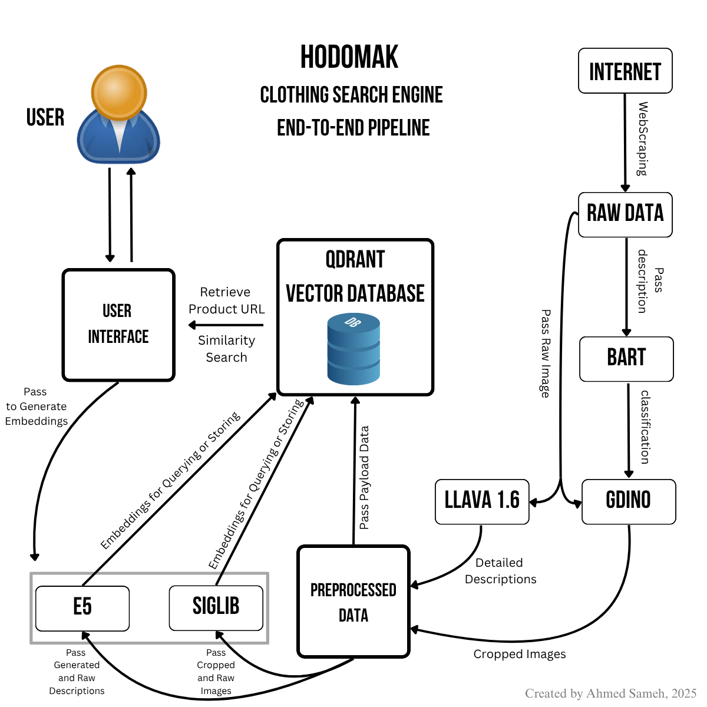

# Hodomak — Multimodal Fashion Search Engine for Local Brands

**Hodomak** is a full-stack multimodal search engine that lets users search clothing items from **local fashion brands** using either **text descriptions** or **images**.  
It combines **computer vision**, **NLP**, and **vector search** to retrieve the most visually or semantically similar products—powered entirely by **open-source models** and running fully locally.

<p align="center">
  
</p>

---

## Key Features

### **Multimodal Retrieval**
- Search by text **or** upload an image.
- Results are ranked via combined **text + image similarity**.

### **Vision + Language Pipeline**
- **LLaVA 1.6** → generates rich visual descriptions.
- **Grounding DINO** → object detection & automated clothing cropping.
- **BART (MNLI)** → classifies clothing category (topwear, bottomwear, etc.).
- **E5-large-v2** → text embeddings.
- **SigLIP SO400M** → image embeddings.

### **Efficient Vector Search**
- Uses **Qdrant** with 4 embedding fields:
  - `image_cropped`
  - `image_original`
  - `text_gen_desc`
  - `text_raw_desc`

### **Multilingual Support**
- Query translation through **GoogleTranslator** (Arabic → English → embeddings).

### **Desktop UI (Tkinter)**
- Modern UI with:
  - text search  
  - image search  
  - live results  
  - product previews  
  - clickable links  

---

## Project Structure

```
hodomak/
│
├── data/
│   ├── raw/          # scraped CSV + raw images (ignored in git)
│   └── processed/    # cropped images, generated captions
│
├── notebooks/        # original Jupyter notebooks (development only)
│
├── src/
│   └── hodomak/
│       ├── scraping.py          # web scraping pipeline
│       ├── preprocessing.py     # GroundingDINO + LLaVA + caption generation
│       ├── store_embeddings.py  # embed + upload to Qdrant
│       └── ui.py                # desktop GUI search app
│
├── .env.example       # template for environment variables
├── .gitignore
├── requirements.txt
└── README.md
```

---

## Installation

### 1. Clone the repo

```bash
git clone https://github.com/YOUR_USERNAME/hodomak.git
cd hodomak
```

### 2. Install dependencies

```bash
pip install -r requirements.txt
```

### 3. Create your environment file

```bash
cp .env.example .env
```

Edit `.env` and add your Qdrant credentials.

---

## How to Run the Pipeline

### **1. Scrape product data**
This scrapes multiple local-brand websites and outputs:

- product titles  
- prices  
- sizes  
- raw descriptions  
- image URLs  

```bash
python src/hodomak/scraping.py
```

Outputs → `data/raw/hedomak_products.csv`

---

### **2. Preprocess images + generate captions**

This includes:

- GroundingDINO cropping (topwear/bottomwear/full-fit)  
- LLaVA caption generation  
- CSV update w/ `cropped_image_path` + `generated_desc`

```bash
python src/hodomak/preprocessing.py
```

---

### **3. Compute embeddings + upload to Qdrant**

This step builds:

- text_raw_desc -> E5  
- text_gen_desc -> E5  
- image_cropped -> SigLIP  
- image_original -> SigLIP  

and stores them in Qdrant.

```bash
python src/hodomak/store_embeddings.py
```

---

### **4. Launch the Desktop UI**

```bash
python src/hodomak/ui.py
```

You'll get a full interactive UI with:

- text search (with auto-translation)
- image search
- clickable product links
- scrollable layout
- reranking combining image + text similarity

---

## Retrieval Scoring

Each query gets a combined score:

### Text Query:
```text
score = β * sim(text_gen_desc, query) 
       + (1 - β) * sim(text_raw_desc, query)
```

### Image Query:
```text
score = α * sim(image_cropped, query)
       + (1 - α) * sim(image_original, query)
```

Best results empirically at:
- **α = 0.8**
- **β = 0.7**

---

## Models Used

| Component | Model | Source |
|----------|-------|--------|
| Captioning | LLaVA 1.6 | llava-hf |
| Object detection | GroundingDINO base | IDEA-Research |
| Classification | BART-large-MNLI | Facebook |
| Text embeddings | E5-large-v2 | Intfloat |
| Image embeddings | SigLIP SO400M | Google |
| Vector DB | Qdrant | qdrant.tech |

---

## Future Improvements
- Support mobile client (Flutter/Tauri)
- Add local-brand expansion pipeline
- Add CLIP benchmarking for comparison
- Transition GUI → minimal web app
- Add async pipeline for faster scraping

---

## License
MIT License. Feel free to use and modify.

---

## Acknowledgements
Thanks to open-source model developers (LLaVA, BART, SigLIP, E5, GroundingDINO, Qdrant) that inspired this project.
